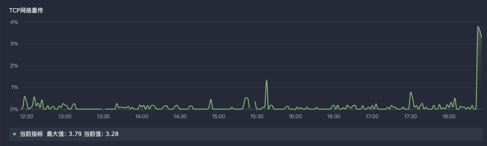

## categref配置

需要先启用插件 `input.node_exporter` 并且在配置文件中启用网络采集 `netstat`

详细配置如下:

```toml
collectors = [
  "--path.procfs=/host/proc",
  "--collector.netstat",
]
# collectors=[]
```

## 指标写法

获取本机的 `node_netstat_Tcp_RetransSegs` 减去一分钟前的 `node_netstat_Tcp_RetransSegs` 除以 `node_netstat_Tcp_OutSegs` 减去一分钟前的 `node_netstat_Tcp_OutSegs` 乘以 100 得到的百分比值。
<br />
最后再直接以指定字段进行分组后求最大值。

```txt
max by(分组字段)
((
(node_netstat_Tcp_RetransSegs{过滤条件,比如你的IP地址或者HOSTID} - node_netstat_Tcp_RetransSegs{过滤条件,比如你的IP地址或者HOSTID} offset 1m)
/
(node_netstat_Tcp_OutSegs{过滤条件,比如你的IP地址或者HOSTID}  -  node_netstat_Tcp_OutSegs{过滤条件,比如你的IP地址或者HOSTID} offset 1m)
)) * 100
```

## 效果示例

