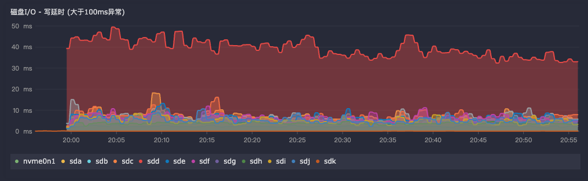

## categref配置

需要先启用插件 `input.node_exporter` 并且在配置文件中启用网络采集 `diskstats`


详细配置如下:

```toml
collectors = [
  "--path.procfs=/host/proc",
  "--collector.diskstats",
]
# collectors=[]
```

## 指标写法

通过指标 `node_disk_write_time_seconds_total` 和 `node_disk_writes_completed_total` 获取到磁盘的写入时间和写入次数。

接下来开始计算，计算公式如下：

1. 计算写入时间差值
2. 计算写入次数差值
3. 计算写入时间差值除以写入次数差值，得到写入速度


最终的查询语句如下：

```txt
max by(device) 
(
    ((node_disk_write_time_seconds_total{ipmi_ip="$search_ipmi",device!~"^(sd[a-z][0-9]|sr|nbd).*"} * 1000) 
    -
    (node_disk_write_time_seconds_total{ipmi_ip="$search_ipmi",device!~"^(sd[a-z][0-9]|sr|nbd).*"} offset 1m  * 1000)) 
/
    ((node_disk_writes_completed_total{ipmi_ip="$search_ipmi",device!~"^(sd[a-z][0-9]|sr|nbd).*"})
    -
    (node_disk_writes_completed_total{ipmi_ip="$search_ipmi",device!~"^(sd[a-z][0-9]|sr|nbd).*"} offset 1m))
)
```

## 效果示例


