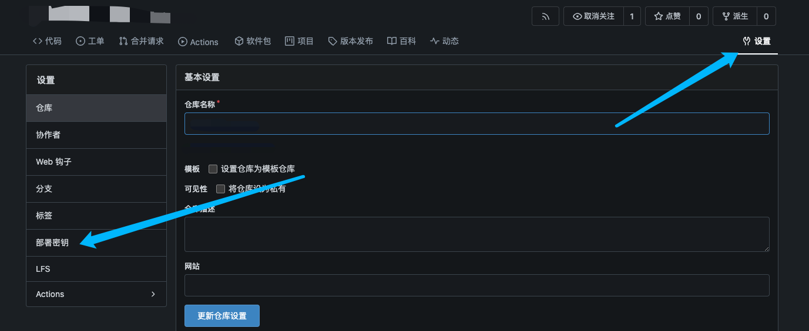
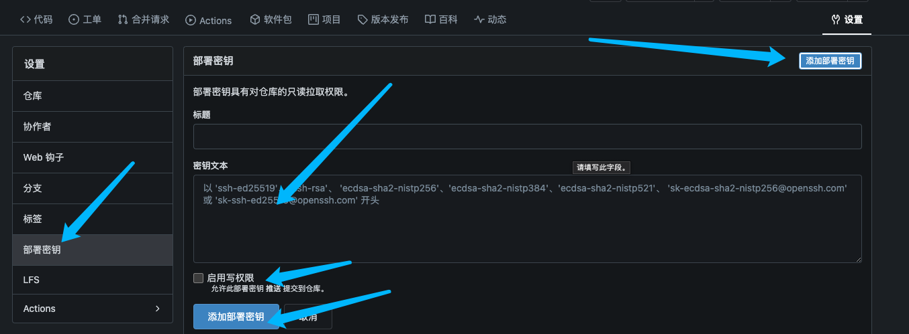

## 创建公钥

创建名为rsa的秘钥对，并设置好你的邮箱地址，全程回车即可。

```bash
ssh-keygen -t rsa -b 4096 -C "your_email@example.com"
```

创建完成后应该会在你的用户目录下生成两个文件：

- id_rsa：私钥
- id_rsa.pub：公钥

## 添加公钥到GitHub

如果你使用的是`gitea`那么按照如下步骤操作即可，将你的`id_rsa.pub`文件内容复制到密钥文本中，并且启用写权限然后添加即可






## 为什么需要部署秘钥?

在我们使用Git进行版本控制的时候，我们需要将代码上传到远程仓库，而远程仓库需要验证你的身份，如果你使用http的方式，
那么每次你push代码的时候，都需要输入用户名和密码，这显然是不方便的，所以我们需要使用SSH的方式进行验证。

但是SSH的验证方式需要你生成一对密钥，并将公钥添加到远程仓库中，这样才能进行验证。而它的好处就是不需要你每次push
都输入用户名和密码，只添加好公钥即可。
