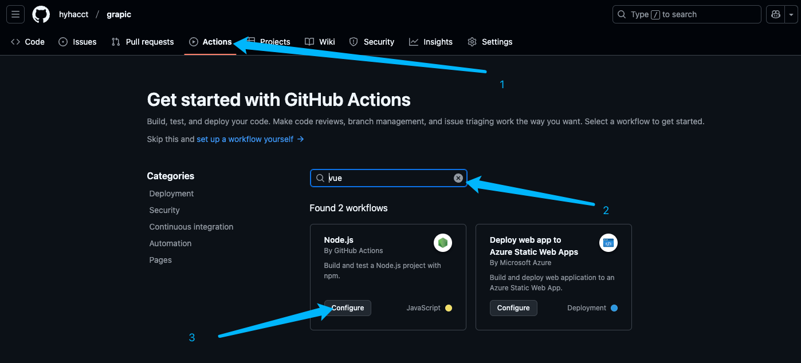
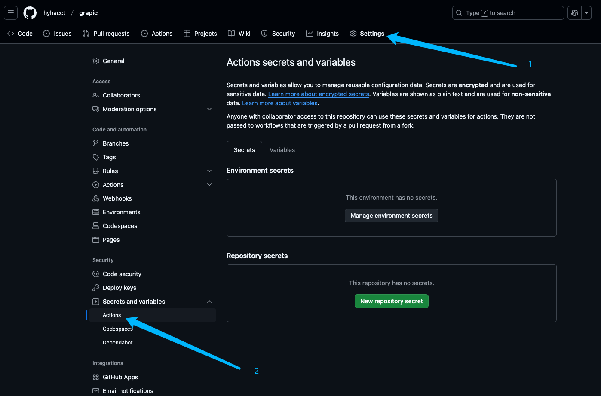

# 概述

前段时间我一直在思考，我这云服务器用来部署这个文档的话，有什么轻量并且可靠点的工具来帮我实现CI/CD？

你还真别说，研究了一番发现了这个问题的答案是：`GitHub Actions`。

确实很好用，有了他，我每次提交这个文档项目到GitHub就可以自动触发CI/CD流程，从而实现文档的自动更新。

接下来做个文档，记录一下配置方法，以防以后自己忘记怎么操作了。

## 配置方法

1. 准备一个GitHub账号，如果没有的话，请注册一个。

2. 登录GitHub，找到你要部署CI/CD项目，点击右上角的“Actions”按钮，然后点击“New workflow”按钮。

3. 选择模板，因为我的项目是基于VuePress搭建的，所以我选择的是Nodejs模板。



## 配置流程

接下来我们正式开始配置工作流程。

这个时候你应该已经进入一个`yml`文件编辑的页面了，接下来直接贴我的配置：

```yaml
name: Deploy to Server

on:
  push:
    branches: [ "main" ]  # 当推送到 main 分支时触发

jobs:
  build:
    runs-on: ubuntu-latest

    steps:
    - name: Checkout code
      uses: actions/checkout@v4  # 拉取代码

    - name: Set up Node.js
      uses: actions/setup-node@v4
      with:
        node-version: '20.x'  # 你可以指定 Node.js 版本
        cache: 'npm'          # 缓存 npm 依赖，加快构建速度

    - name: Install dependencies and build
      run: |
        npm install         # 安装依赖
        npm run docs:build  # 执行构建

    - name: Set up SSH
      env:
        SSH_PRIVATE_KEY: ${{ secrets.SSH_PRIVATE_KEY }}   # 从 GitHub Secrets 获取 SSH 私钥
        SERVER_IP: ${{ secrets.SERVER_IP }}               # 从 GitHub Secrets 获取服务器 IP
      run: |
        mkdir -p ~/.ssh                                                 # 创建 .ssh 目录
        echo "${{ secrets.SSH_PRIVATE_KEY }}" > ~/.ssh/id_rsa           # 写入私钥
        chmod 600 ~/.ssh/id_rsa                                         # 设置权限
        ssh-keyscan -H ${{ secrets.SERVER_IP }} >> ~/.ssh/known_hosts   # 添加服务器公钥

    - name: Deploy to server
      env:
        SERVER_IP: ${{ secrets.SERVER_IP }}        # 从 GitHub Secrets 获取服务器 IP
        SERVER_USER: ${{ secrets.SERVER_USER }}    # 从 GitHub Secrets 获取服务器用户名
      run: |
        ssh $SERVER_USER@$SERVER_IP "sudo rm -rf /opt/nginx/www/*"         # 先删除原有文件
        scp -r ./.vitepress/dist/* $SERVER_USER@$SERVER_IP:/opt/nginx/www/ # 将构建好的文件传输到服务器
```

## 配置详解

接下来容我拆分一下这个配置，介绍下这个配置的详细含义。

### 1. 触发条件

```yaml
on:
  push:
    branches: [ "main" ]  # 当推送到 main 分支时触发
```

### 2. 构建环境

```yaml
jobs:
  build:
    runs-on: ubuntu-latest
```

3. 拉取代码

```yaml
    - name: Checkout code
      uses: actions/checkout@v4  # 拉取代码
```

4. 安装 Node.js

```yaml
    - name: Set up Node.js
      uses: actions/setup-node@v4
      with:
        node-version: '20.x'  # 你可以指定 Node.js 版本
        cache: 'npm'          # 缓存 npm 依赖，加快构建速度
```

5. 安装依赖并构建

```yaml
    - name: Install dependencies and build
      run: |
        npm install           # 安装依赖
        npm run docs:build    # 执行构建
```

6. 设置 SSH 连接

```yaml
    - name: Set up SSH
      env:
        SSH_PRIVATE_KEY: ${{ secrets.SSH_PRIVATE_KEY }}  # 从 GitHub Secrets 获取 SSH 私钥
        SERVER_IP: ${{ secrets.SERVER_IP }}              # 从 GitHub Secrets 获取服务器 IP
      run: |
        mkdir -p ~/.ssh                                                 # 创建 .ssh 目录
        echo "${{ secrets.SSH_PRIVATE_KEY }}" > ~/.ssh/id_rsa           # 写入私钥
        chmod 600 ~/.ssh/id_rsa                                         # 设置权限
        ssh-keyscan -H ${{ secrets.SERVER_IP }} >> ~/.ssh/known_hosts   # 添加服务器公钥
```

7. 部署到服务器

```yaml
    - name: Deploy to server
      env:
        SERVER_IP: ${{ secrets.SERVER_IP }}       # 从 GitHub Secrets 获取服务器 IP
        SERVER_USER: ${{ secrets.SERVER_USER }}   # 从 GitHub Secrets 获取服务器用户名
      run: |
        ssh $SERVER_USER@$SERVER_IP "sudo rm -rf /opt/nginx/www/*"         # 先删除原有文件
        scp -r ./.vitepress/dist/* $SERVER_USER@$SERVER_IP:/opt/nginx/www/ # 将构建好的文件传输到服务器
```

### 8. 配置 Secrets

最后，我们需要在 GitHub 项目的 Settings -> Secrets 页面配置以下 Secrets，这一步必须要做，毕竟肯定不能把隐私信息暴露到配置文件，以免造成安全隐患。

- `SSH_PRIVATE_KEY`：SSH 私钥，用于连接服务器。
- `SERVER_IP`：服务器 IP，用于连接服务器。
- `SERVER_USER`：服务器用户名，用于连接服务器。



配置完成后，我们就可以愉快的玩耍了。每次推送代码到 GitHub，GitHub Actions 就会自动触发 CI/CD 工作流，自动将打包好的文档部署到服务器。

## 总结

通过上面的配置，我们成功实现了文档的自动更新，而且还能自动部署到服务器，接下来你配置好了的话，就可以尝试推送代码，看看Actions是否能正常工作了。

这个玩法我现在都还在使用，哈哈哈。太轻量方便了，不用部署Jenkins，不用搭建环境，直接用GitHub Actions就搞定了。

## 注意事项

最后注意一下，看看你的本地项目根目录下有没有一个`.github/workflows/deploy.yml`文件，如果没有的话你自己手动创建一个，然后把你的yml配置粘贴进去就行了。
