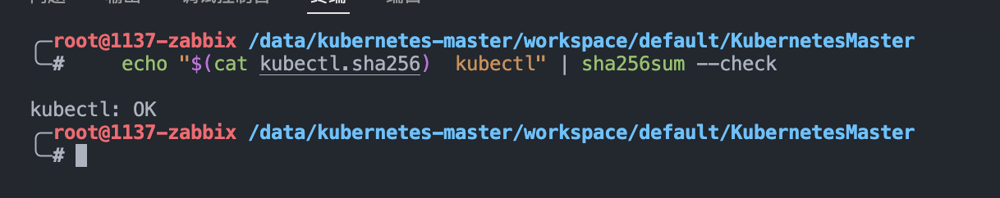

# 概述

简单记录一下`Kubernetes`的安装配置过程。

## 安装kubectl

当前我使用的系统是`Docker Dind` 的 `Ubuntu`，使用下面的这个命令是一次通过下载和验证的。

```bash
{
    # 下载kubectl
    curl -LO "https://dl.k8s.io/release/$(curl -L -s https://dl.k8s.io/release/stable.txt)/bin/linux/amd64/kubectl"

    # 下载kubectl.sha256
    curl -LO "https://dl.k8s.io/release/$(curl -L -s https://dl.k8s.io/release/stable.txt)/bin/linux/amd64/kubectl.sha256"

    # 基于校验和文件，验证 kubectl 的可执行文件是否被篡改
    echo "$(cat kubectl.sha256)  kubectl" | sha256sum --check

    # 安装 kubectl 到/usr/local/bin目录
    sudo install -o root -g root -m 0755 kubectl /usr/local/bin/kubectl
}
```




## 安装kubelet、kubeadm

这里稍微注意下，可能`apt-key.gpg`是下载不过来的，但是你可以手动复制地址去下载，然后上传到服务器中

接着使用`apt-key add ./apt-key.gpg`进行安装，[gpg下载地址](https://packages.cloud.google.com/apt/doc/apt-key.gpg)

```bash
{
    # 安装 kubelet、kubeadm
    apt-get update
    apt-get install -y apt-transport-https curl
    curl -s https://packages.cloud.google.com/apt/doc/apt-key.gpg | apt-key add -
    cat <<EOF >/etc/apt/sources.list.d/kubernetes.list
deb https://apt.kubernetes.io/ kubernetes-xenial main
EOF
    apt-get update
    apt-get install -y kubelet kubeadm
    apt-mark hold kubelet kubeadm
}
```
