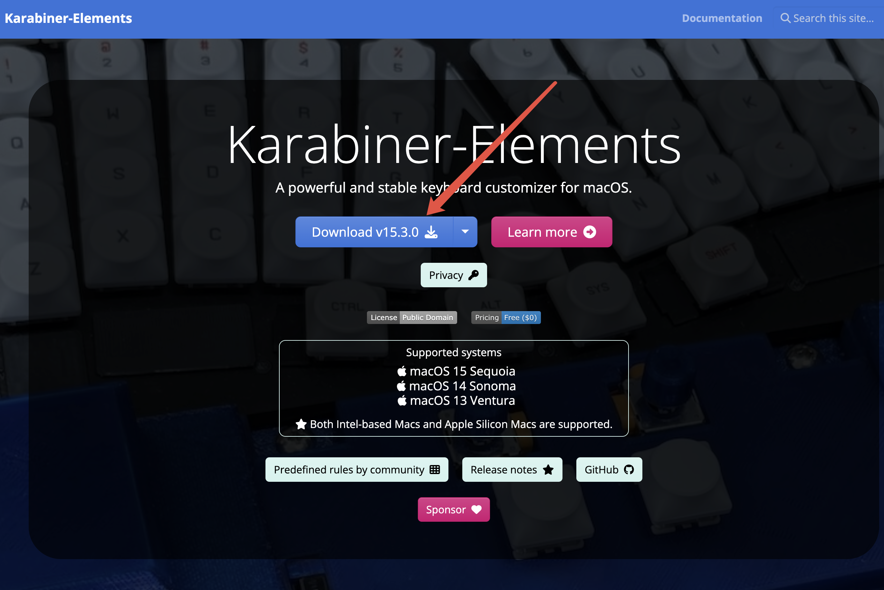
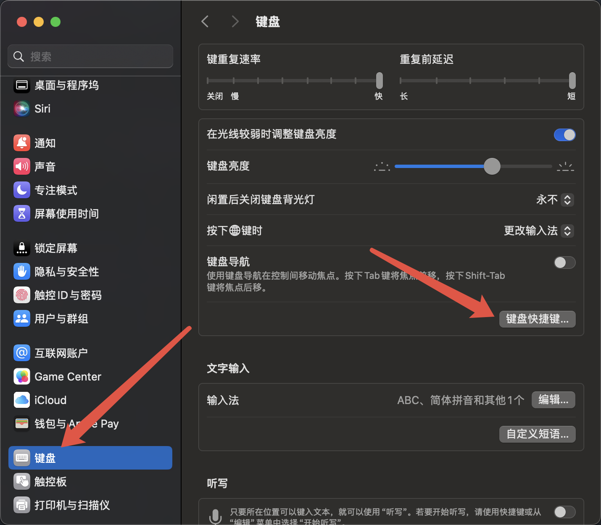
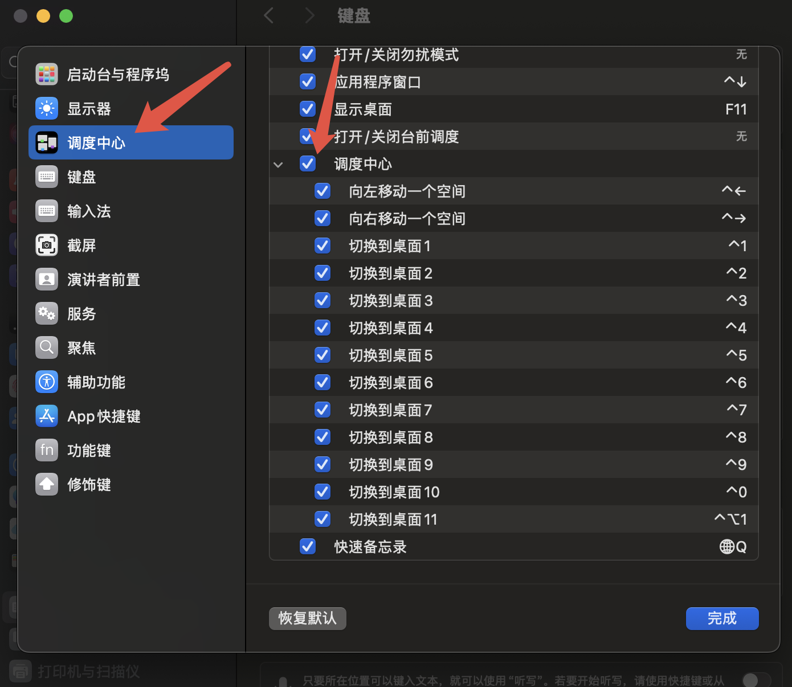
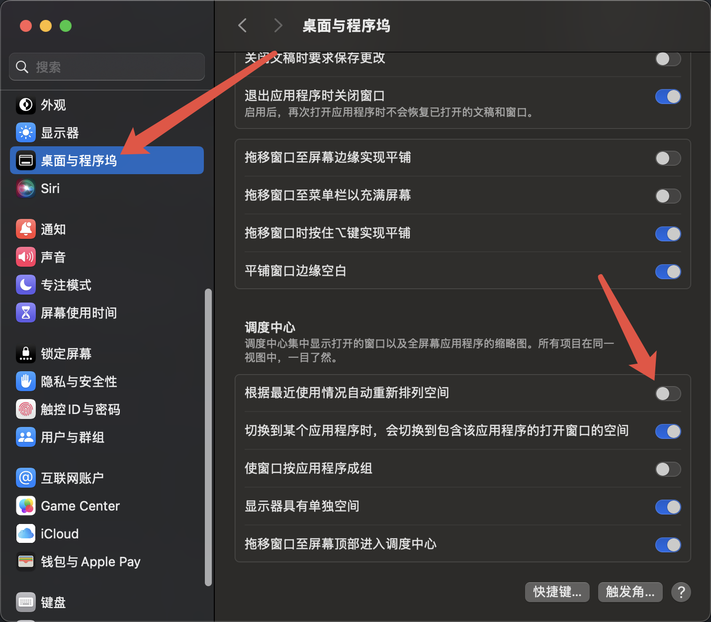
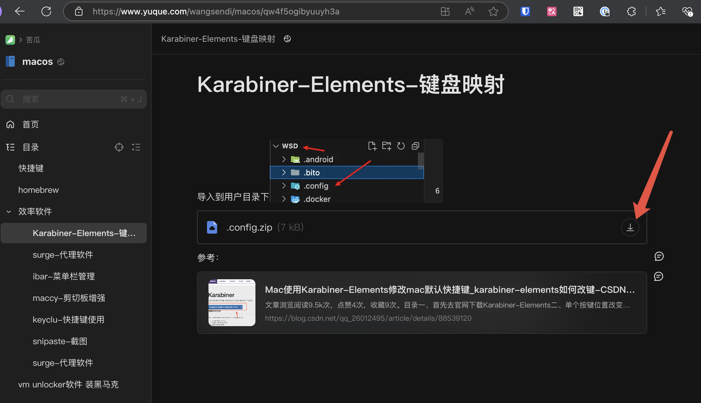
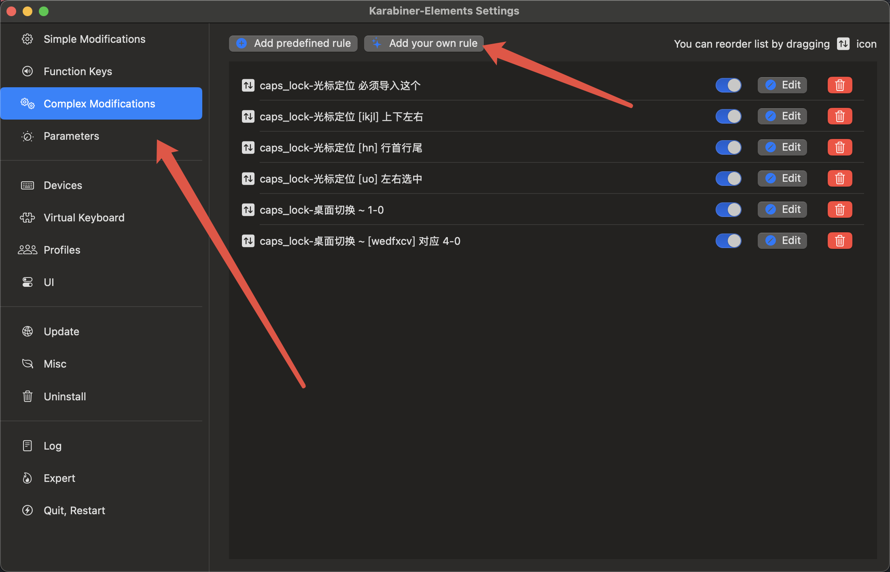

# 概述

Karabiner-Elements是一款开源的跨平台的键盘定制工具，可以用来自定义键盘快捷键、鼠标映射、脚本操作等。

这个工具真的非常nice，很好用，推荐尝试一下，我主要喜欢使用他的快捷键切屏，效率非常高。

建议直接参考文档：

- [lwmacct的语雀文档](https://www.yuque.com/lwmacct/macos/opx2ricrpcchoki7)
- [sendi的语雀文档](https://www.yuque.com/wangsendi/macos/qw4f5ogibyuuyh3a)

这两文档内容比较实用，建议多看。

## 安装

直接访问 [官网地址](https://karabiner-elements.pqrs.org/) 下载然后安装他，这里就先不多介绍了。

## 创建多窗口

要用到窗口切换功能，肯定是要先有多窗口，这里先添加10个窗口，`三指上划`切换窗口页面添加。

直接从这里加，加到10个就行了。

## 启用切屏快捷键

接下来打开系统设置，进入键盘 -> 键盘快捷键 -> 调度中心，将快捷键切屏全部启用。

## 关闭自动排列

这里还要注意，把这个自动排列关掉，不然某些屏幕里面的窗口开启和关闭会自动排列顺序，影响切屏体验！！！

## 打开应用&写入配置

这里直接访问苦瓜的文档，把他的配置拉下来先。

然后在下面这个位置把你的下载好的配置内容放过去，点击应用，应用即可生效。

## 最后

测试一下，按住`大小写切换键` + 上方的数字键`0-9`，应该就全都可以切屏了。

最后，祝你使用愉快！
