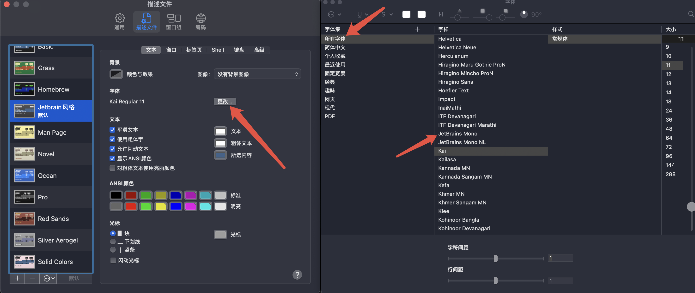

# 概述

个人觉得Jetbrain风格的字体看起来很舒服，所以这里做个文档记录一下我是自己配置的

方便以后换设备了，可以快速配置。

## 下载Jetbrain字体

[JetBrains Mono项目地址](https://github.com/JetBrains/JetBrainsMono)

```bash
brew install --cask font-jetbrains-mono
```

命令介绍：

- `brew install --cask font-jetbrains-mono`：安装字体
- `--cask`：参数含义是安装字体，`--font`是安装字体库

## 配置Terminal字体

在终端的设置中选择安装好的字体就行了




## 样式

