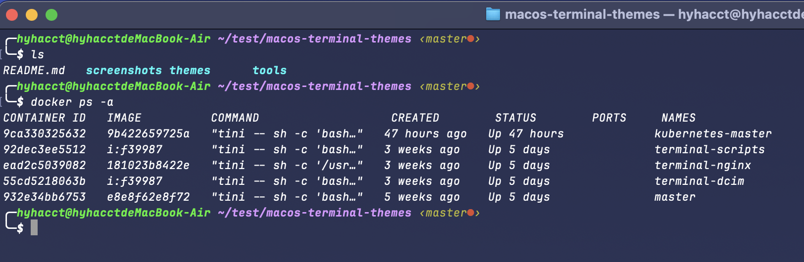
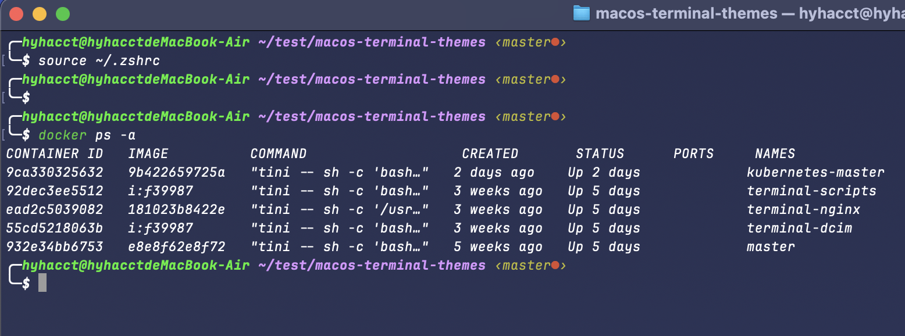
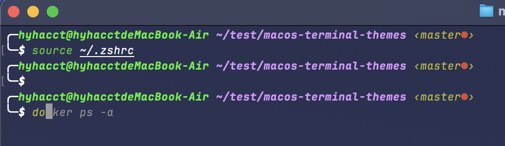
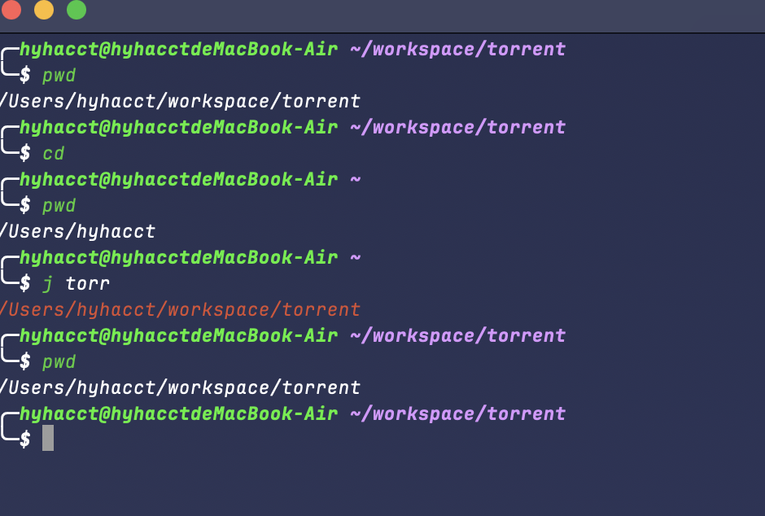

# 概述

介绍几个插件

## zsh-syntax-highlighting

字体高亮插件：`zsh-syntax-highlighting`

```bash
cd $ZSH_CUSTOM/plugins # 进入自定义插件目录
git clone https://github.com/zsh-users/zsh-syntax-highlighting.git # 下载插件
```

接下来需要在 `~/.zshrc` 文件中添加插件，在 `plugins` 中添加 `zsh-syntax-highlighting` 插件：

```bash
plugins=(git zsh-syntax-highlighting)
```

然后重新加载配置文件：

```bash
source ~/.zshrc
```

`未安装 && 已安装`对比结果：





## zsh-autosuggestions

自动补全插件：`zsh-autosuggestions`

```bash
cd $ZSH_CUSTOM/plugins # 进入自定义插件目录
git clone https://github.com/zsh-users/zsh-autosuggestions.git # 下载插件
```


```bash
plugins=(git zsh-syntax-highlighting zsh-autosuggestions)
```

然后重新加载配置文件：

```bash
source ~/.zshrc
```

> [!IMPORTANT]
> 这个时候你尝试输入命令他就会自动提示，按下方向键 `->` 就会自动补全




## autojump

自动跳转插件：`autojump` 安装使用

```bash
cd $ZSH_CUSTOM/plugins # 进入自定义插件目录
git clone https://github.com/wting/autojump.git # 下载插件
cd autojump && python3 ./install.py
```


这个时候有一串输出

```
Please manually add the following line(s) to ~/.zshrc:

        [[ -s <用户目录>/.autojump/etc/profile.d/autojump.sh ]] && source <用户目录>/.autojump/etc/profile.d/autojump.sh

        autoload -U compinit && compinit -u

Please restart terminal(s) before running autojump.
```

按照输出的消息，我们需要在 `~/.zshrc` 文件中添加以下内容：

```bash
[[ -s <用户目录>/.autojump/etc/profile.d/autojump.sh ]] && source <用户目录>/.autojump/etc/profile.d/autojump.sh
autoload -U compinit && compinit -u
```

然后重新加载配置文件：

```bash
source ~/.zshrc
```

然后就可以使用了，命令简单使用：

```bash
j <文件夹名称> # 跳转到指定文件夹, 比如 j Desktop 就会跳转到 Desktop 文件夹
```


