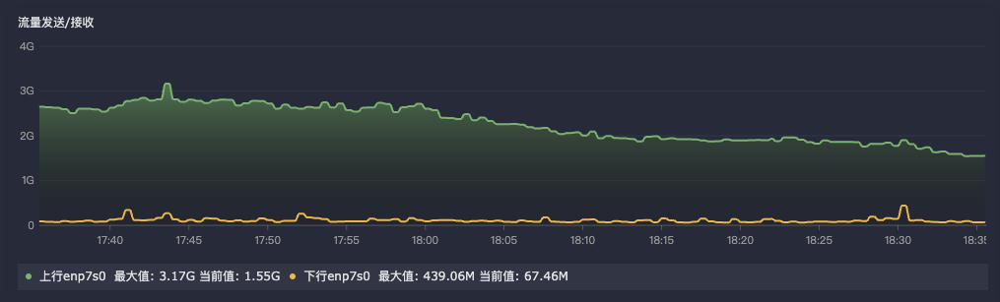

## categref配置

需要先启用插件 `input.net` 并且在配置文件中配置 `interfaces` 采集需要的网卡（直接全部采集也行）

详细配置如下:

```toml
# # collect interval
# interval = 15

# # whether collect protocol stats on Linux
# collect_protocol_stats = false

# # setting interfaces will tell categraf to gather these explicit interfaces
# interfaces = ["eth0"]
interfaces = ["eth0"]

# enable_loopback_stats=true
# enable_link_down_stats=true
```

## 指标写法

通过指标 `net_bytes_sent` 和 `net_bytes_recv` 可以获取网卡的发送和接收字节数。
并且写好过滤规则，网卡建议把虚拟的全部过滤掉，只监控真实的物理网卡。

使用函数 `irate` 并获取过去5分钟的平均速率，单位为bit/s。需要将结果再乘以8，单位转换为B/s。

最终以 `interface` 进行分组，求和得到总的网卡发送速率。可以自行 `/ 1024 / 1024` 转换为MB/s。

```txt
sum by (interface) (
  irate(net_bytes_sent{ip="服务器的IP地址", interface!~"正则过滤掉虚拟网卡"}[5m]) * 8
)
```

## 效果示例

