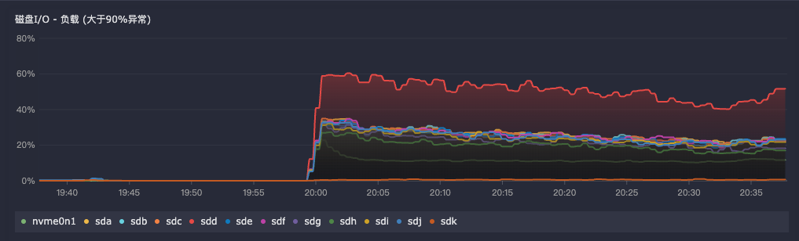

## categref配置

需要先启用插件 `input.diskio` 并且配置 `devices` 启用正则匹配所有需要采集的磁盘

详细配置如下:

```toml
# # collect interval
# interval = 15

# # By default, categraf will gather stats for all devices including disk partitions.
# # Setting devices will restrict the stats to the specified devices.
# devices = ["sda", "sdb", "vd*"]

devices = ["sd[a-z]*", "nvme*"]
```

## 指标写法

通过指标 `diskio_io_time` 可以获取磁盘的读写时间，并且通过 `max by(name)` 聚合所有磁盘的读写时间，然后通过 `offset 1m` 延迟一分钟。

最后除以 60 (因为延时了1m，是60秒，所以需要除以60) 再除以 1000 得到1分钟的磁盘I/O百分比。

```txt
(
max by(name) (diskio_io_time{ipmi_ip="$search_ipmi",name!~"^(sd[a-z][0-9]|sr|nbd).*"})
-
max by(name) (diskio_io_time{ipmi_ip="$search_ipmi",name!~"^(sd[a-z][0-9]|sr|nbd).*"} offset 1m)
) / 60 / 1000
```

## 效果示例


