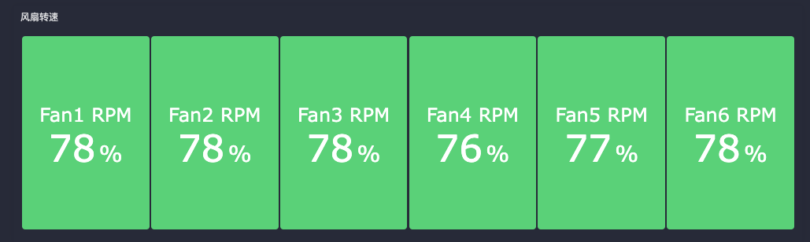

## categref配置

需要先启用插件 `input.ipmi`

详细配置如下:

```toml
# Read metrics from the bare metal servers via freeipmi
[[instances]]
# target指定是本地采集还是远程采集
target = "localhost"
# 指定采集的用户名和密码，这里务必保证ipmi命令能获取正确输出，不是网上查到一个用户名 密码就可以。
#user = "user"
#pass = "1234"

# ipmi协议版本，支持1.5 和 2.0 
#driver = "LAN_2_0"

# 指定特权用户名
#privilege = "user"

## session-timeout, ms
#timeout = 100000

# 支持的采集器  bmc, bmc-watchdog, ipmi, chassis, dcmi, sel，sm-lan-mode
# 默认使用 bmc, ipmi, chassis和dcmi，建议保持下列配置便于仪表盘更好的展示

collectors = ["bmc", "ipmi", "chassis", "sel", "dcmi"]
# 不关注的传感器，指定id 排除掉
#exclude_sensor_ids = [ 2, 29, 32, 50, 52, 55 ]

# 如果你想使用定制化的参数覆盖内置的命令，可以修改以下内容； 建议保持注释
#[instances.collector_cmd]
#ipmi = "sudo"
#sel = "sudo"
#[instances.default_args]
#ipmi = [ "--bridge-sensors" ]
#[instances.custom_args]
#ipmi = [ "--bridge-sensors" ]
#sel = [ "ipmi-sel" ]
```

## 指标写法

通过指标 `ipmi_fan_speed_rpm` 可以获取风扇的当前转速，单位rpm。

需要通过计算来获取当前转速百分比，可以用以下公式（假设风扇最大转速为19000rpm）。

1. 首先获取风扇当前转速，单位rpm。
2. 然后除以19000，得到百分比。
3. 乘以100，得到百分比。

最终的查询语句如下：

```txt
max by(name) (ipmi_fan_speed_rpm{ipmi_ip="$search_ipmi"} / 19000 * 100)
```

## 效果示例


