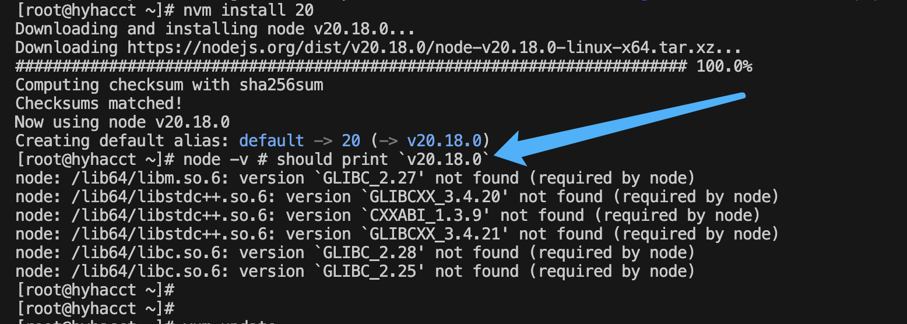

## 问题描述

glibc 和 libstdc++ 版本过低时，会出现以下错误：




## 解决方案

尝试升级 glibc 和 libstdc++ 版本，我当前使用的系统是CentOS 7，那么开始吧：

> [!CAUTION]
> 在 CentOS 7 上，升级 glibc 是比较复杂和具有潜在风险的操作，因为它是系统的核心库。升级不当可能导致系统不可用，所以在升级时一定要小心操作，能不动最好是不要去动他。

### 准备编译环境 GCC

因为我的GCC版本比较久，所以我选择升级GCC版本后再开始编译，如果你的GCC版本比较新，可以直接`跳过这一步`。

```bash
yum install centos-release-scl -y # 安装 SCL 源
yum install devtoolset-9-gcc devtoolset-9-gcc-c++ -y # 安装更新的 GCC
scl enable devtoolset-9 bash # 启用新版本的 GCC
```


### 下载 glibc 源代码
```bash
# 下载 glibc 2.27 的源代码
wget http://ftp.gnu.org/gnu/glibc/glibc-2.27.tar.gz

# 解压缩文件
tar -xvzf glibc-2.27.tar.gz
cd glibc-2.27
```


### 升级 glibc
```bash
# 创建一个单独的编译目录
mkdir build
cd build

# 配置编译选项，将 glibc 安装到 /opt/glibc-2.27
../configure --prefix=/opt/glibc-2.27

# 开始编译并安装
make -j4
make install
```


### 设置环境变量

```bash
export LD_LIBRARY_PATH=/opt/glibc-2.27/lib:$LD_LIBRARY_PATH
echo "export LD_LIBRARY_PATH=/opt/glibc-2.27/lib:\$LD_LIBRARY_PATH" >> /etc/profile
source /etc/profile
```

### 验证安装

```bash
/opt/glibc-2.27/lib/ld-2.27.so --version
```