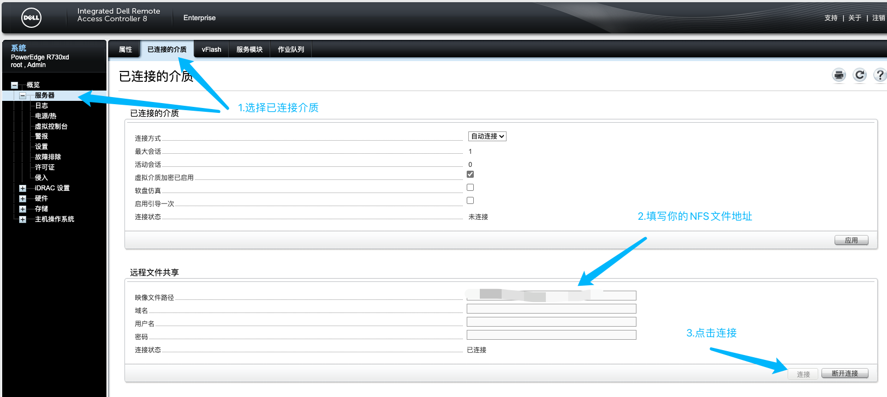
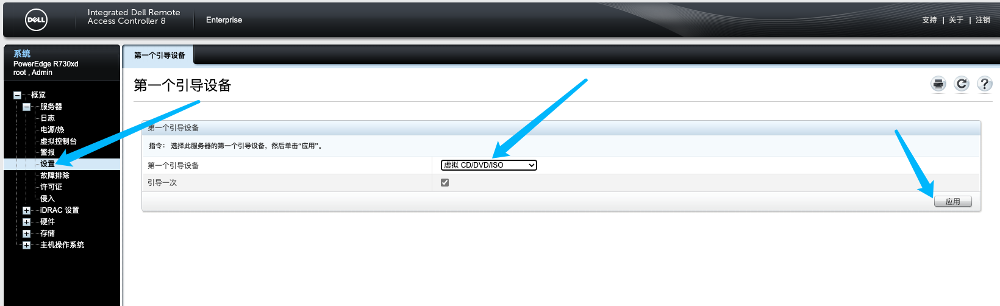

# 概述

该方法是通过Dell服务器的远程介质来进行系统重装，需确保有两台服务器

1台服务器部署NFS服务，用于共享系统镜像文件。

1台则是需要重装的服务器，这台设备需要是Dell的服务器，具有IPMI功能。


## NFS服务部署

既然是远程介质，那么肯定需要有一个远程地址可以提供镜像的下载，这里咱们使用NFS来共享系统镜像文件。

这边建议是NFS服务器与需要被重装的服务器在同一个局域网下，可以使用内网IP进行挂载。

```bash
# 创建目录和下载镜像文件
mkdir -p /data/iso ; cd /data/iso ; wget https://xxxxx/os.iso
```

安装并启动NFS服务

::: code-group
```bash [CentOS]
rpm -q nfs-utils || yum -y install nfs-utils
systemctl enable --now rpcbind
systemctl enable --now nfs
echo "/data/iso *(ro,sync,all_squash)" >/etc/exports && exportfs -rv
systemctl restart rpcbind
systemctl restart nfs
```

```bash [Ubuntu/Debian]
apt update
apt install -y nfs-common nfs-kernel-server
echo "/data/iso *(rw,sync,insecure,no_root_squash)" >/etc/exports && exportfs -rv
systemctl enable --now nfs-kernel-server
```
:::

## 配置IPMI

需要重装的服务器需要配置IPMI，用来挂载远程介质。

接下来就是需要设置引导设备，选择`虚拟CD/DVD/ISO`并应用。





> [!IMPORTANT]
> 请注意，重装进行期间请保证NFS服务正常，否则可能导致系统重装失败。

至此，NFS服务部署以及IPMI配置完成，可以开始进行重装。

重启服务器，按下F11，进入正常的重装流程即可。


## 可能出现的问题

如果发现重装完成后，服务器开始重启，但是又进入了重装，请将IPMI中的远程介质断开即可。

或者在重装完成后，开始重启时将远程介质断开，即可避免无限重装的情况。
