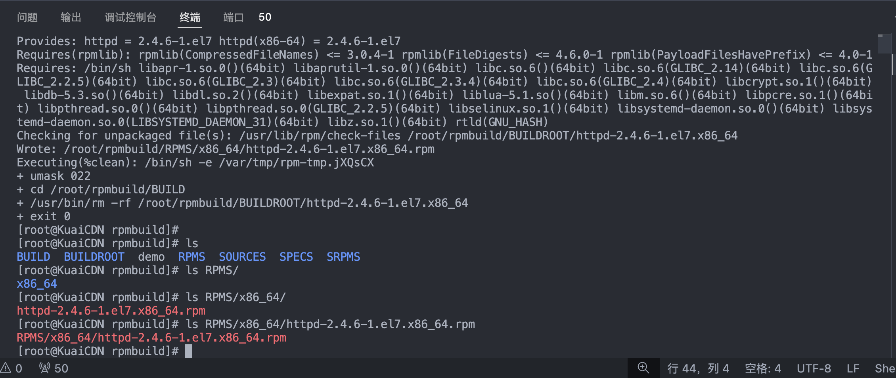

# 概述

在有些时候可能我们需要对系统中某个已有的软件进行反向rpm打包，即将该软件打包成一个rpm包，然后安装到其他机器上。

本文将介绍如何对 CentOS 系统中的软件进行反向打包。

# 准备工作

在开始前，我们需要先准备好以下环境：

- CentOS 7 系统
- 已有软件
- rpmbuild 工具

```bash
# 安装 rpmbuild 工具
yum install rpm-build rpmdevtools -y
```


## 开始操作

第一步我们先查看已安装软件包含的所有文件，在这里，我假设查看`httpd`的。

```bash
rpm -ql httpd
```

输出结果如下：

```txt
[root@KuaiCDN build]# rpm -ql httpd
/etc/httpd
/etc/httpd/conf
/etc/httpd/conf.d
/etc/httpd/conf.d/README
/etc/httpd/conf.d/autoindex.conf
/etc/httpd/conf.d/userdir.conf
/etc/httpd/conf.d/welcome.conf
/etc/httpd/conf.modules.d
/etc/httpd/conf.modules.d/00-base.conf
/etc/httpd/conf.modules.d/00-dav.conf
/etc/httpd/conf.modules.d/00-lua.conf
/etc/httpd/conf.modules.d/00-mpm.conf
/etc/httpd/conf.modules.d/00-proxy.conf
/etc/httpd/conf.modules.d/00-systemd.conf
/etc/httpd/conf.modules.d/01-cgi.conf
/etc/httpd/conf/httpd.conf
/etc/httpd/conf/magic
/etc/httpd/logs
/etc/httpd/modules
/etc/httpd/run
/etc/logrotate.d/httpd
/etc/sysconfig/htcacheclean
/etc/sysconfig/httpd
/run/httpd
...省略十万八千行输出...
[root@KuaiCDN build]# 
```

## 脚本拷贝文件

可以看到，东西还是蛮多的，如果我们要将这么多的东西都挨个cp过来，岂不是得累死，这里提供一个脚本：

> [!IMPORTANT]
> 请注意，这里的`httpd-2.4.6-1.el7.x86_64`名称是有说法的，每个字每个数字都有特殊含义，请不要随意修改，如果想了解他的含义，请直接查看下面的【配置创建及介绍】

```bash
{
    _home_path="/root/rpmbuild/BUILDROOT/httpd-2.4.6-1.el7.x86_64" # 自行设置一下编译目录位置
    rm -rf "$_home_path"                                           # 先清理一下(注意，重新执行记得备份你的东西)
    mkdir -p "$_home_path"
    _file_path=$(rpm -ql httpd)
    IFS=$'\n'
    for item in $_file_path; do
        _dir=$(dirname "$item")
        mkdir -p "$_home_path/$_dir"
        yes | cp -rf "$item" "$_home_path/$_dir"
        echo "拷贝:$item -> $_home_path/$_dir"
    done
}
```

脚本的作用是遍历`httpd`软件包中所有的文件，并将其复制到`~/rpmbuild/BUILDROOT/httpd-2.4.6-1.el7.x86_64`目录下，这样就可以准备好打包工作了。


## 配置创建及介绍


接下来我们创建一个`spec`文件

```bash
touch ~/rpmbuild/SPECS/httpd.spec
```

编辑`httpd.spec`文件，内容如下：


```txt
Name: httpd 
Version: 2.4.6
Release: 1%{?dist}
Summary: Apache HTTP Server

License: Apache
URL: https://httpd.apache.org/
Source0: %{name}-%{version}.tar.gz

BuildArch: x86_64

%description
Apache HTTP Server is a powerful, efficient, and extensible web server.

%files
%defattr(-,root,root,-)
/etc/httpd
/etc/logrotate.d/httpd
/etc/sysconfig/htcacheclean
/etc/sysconfig/httpd
/run/httpd
/usr/lib/systemd/system/httpd.service
/var/www
/var/log/httpd
/var/run/httpd
```

%files 部分定义了软件包安装时需要的文件列表，很不巧的是这里需要提供你执行`rpm -ql httpd`所输出的所有路径，全填写进来


> [!TIP]
> 这里的`包名特殊含义`在上面有讲到过，就是你编译之前存放文件的软件包名称，比如`httpd-2.4.6-1.el7.x86_64`，其中`httpd`就是包名，`2.4.6`就是版本，`x86_64`就是架构，以此类推。


这里来介绍下`spec`文件中的一些字段：


- Name：软件包名称 `包名特殊含义`
- Version：软件包版本 `包名特殊含义`
- Release：软件包发行版本 `包名特殊含义`
- Summary：软件包简介
- License：软件包许可证
- URL：软件包官网
- Source0：软件包源码
- BuildArch：软件包编译架构 `包名特殊含义`
- %description：软件包描述
- %files：软件包文件列表
- %defattr：文件属性设置
- /etc/httpd：软件包配置文件
- /etc/logrotate.d/httpd：日志轮转配置
- /etc/sysconfig/htcacheclean：缓存清理配置
- /etc/sysconfig/httpd：软件包服务配置
- /run/httpd：软件包运行时目录
- /usr/lib/systemd/system/httpd.service：软件包服务文件
- /var/www：软件包默认网站目录
- /var/log/httpd：软件包日志目录
- /var/run/httpd：软件包运行时目录


## 开始编译打包

到了这一步，我们直接执行下面的命令进行编译打包：

```bash
rpmbuild -bb ~/rpmbuild/SPECS/httpd.spec
```

执行时可能会出现各种各样的报错，比如：

```txt
[root@KuaiCDN rpmbuild]# rpmbuild -bb ~/rpmbuild/SPECS/httpd.spec
warning: bogus date in %changelog: Sun Dec 24 2024 YourName <youremail@example.com> - 2.4.6-1
Processing files: httpd-2.4.6-1.el7.x86_64
error: File not found: /root/rpmbuild/BUILDROOT/httpd-2.4.6-1.el7.x86_64/var/run/httpd


RPM build errors:
    bogus date in %changelog: Sun Dec 24 2024 YourName <youremail@example.com> - 2.4.6-1
    File not found: /root/rpmbuild/BUILDROOT/httpd-2.4.6-1.el7.x86_64/var/run/httpd
```

很显然，这里是在告诉我，我缺少了`/root/rpmbuild/BUILDROOT/httpd-2.4.6-1.el7.x86_64/var/run/httpd`这个文件，这个文件也是软件包运行时需要的。

因为这个软件包在上面我们的`%files`里面定义的路径，如果你认为他无关紧要，可以在`spec`文件中将其注释掉，或者直接删除。

接下来我们需要手动创建一下：

```bash
mkdir -p /root/rpmbuild/BUILDROOT/httpd-2.4.6-1.el7.x86_64/var/run
cp -r /var/run/httpd /root/rpmbuild/BUILDROOT/httpd-2.4.6-1.el7.x86_64/var/run/httpd
```

然后再次执行编译打包命令：

```bash
rpmbuild -bb ~/rpmbuild/SPECS/httpd.spec
```

## 编译完成

如果顺利，你将看不到任何报错，并且在`~/rpmbuild/RPMS/x86_64`目录下生成了`httpd-2.4.6-1.el7.x86_64.rpm`文件，这个就是我们需要的rpm包。

如图所示：

