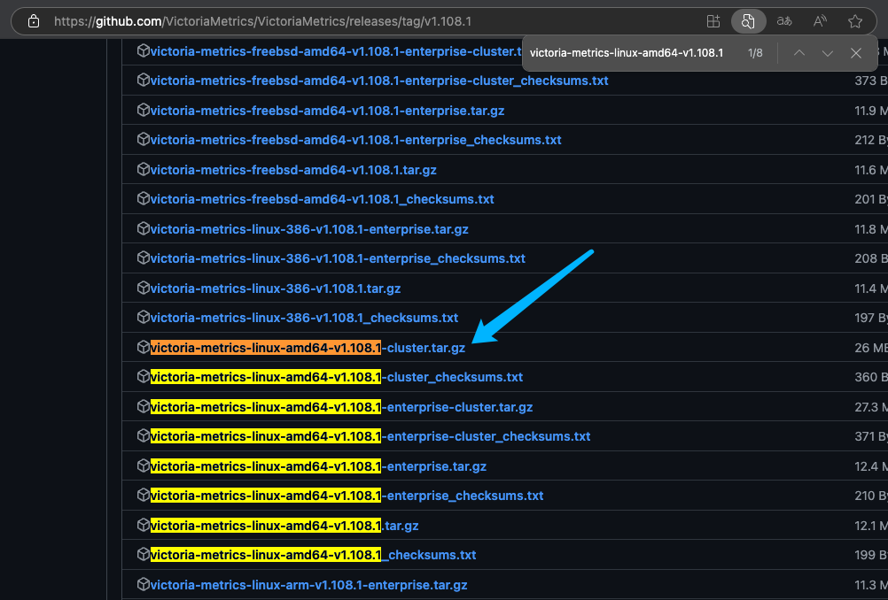

# 概述

为什么会选择 VictoriaMetrics 作为后端存储？既然 Prometheus 已经有了很好的 TSDB，为什么还要选择 VictoriaMetrics？

其实 `VictoriaMetrics` 是一个高效、可扩展的时序数据库，旨在处理大规模时序数据。它支持从 Prometheus 导入数据，并且能提供比 Prometheus 更高的存储效率和更低的成本


## VictoriaMetrics 优势

### 架构和设计

Prometheus:
- 自包含的监控系统，包括数据抓取、存储、查询等功能。
- 内置时间序列存储，使用内存和本地磁盘来保存数据。
- 本地存储限制（如磁盘空间）会影响性能，适合中小规模的数据存储需求。

VictoriaMetrics:
- 专为高效存储设计，可以支持高性能的读取和写入。
- 支持单节点和集群模式，更容易横向扩展。
- 更低的磁盘空间消耗和更高的压缩比。

### 性能对比

Prometheus:
- 默认情况下，Prometheus 存储模式在处理大规模数据时会遭遇性能瓶颈，尤其是存储和查询大量的时序数据时。
- 当数据量非常大时，Prometheus 可能会遇到存储效率差和查询延迟高的问题。
- 适合中小型部署，但在大规模环境下性能可能受限。

VictoriaMetrics:
- 在高负载和大量数据场景下的存储效率更高，具有更低的磁盘使用量。
- 对比 Prometheus，VictoriaMetrics 提供更快的数据写入、查询和压缩性能。
- 特别适合大规模、高并发的时序数据存储，支持数百万个指标。

### 存储和压缩

Prometheus:
- 使用基于时间序列的存储，数据存储结构和压缩方式相对简单。
- 数据存储的大小随着时间推移线性增长，且存储压缩效率较低。
- 大量数据存储会导致磁盘空间和内存占用的急剧增加。

VictoriaMetrics:
- 提供更高的存储压缩比，数据压缩效率显著优于 Prometheus。
- 可以通过一些高级压缩算法（如 LZ4）减少存储空间的需求，存储扩展性更强。
- 对大规模数据处理时的存储效率优化更为突出。

### 查询语言

Prometheus:
- Prometheus 提供了 PromQL（Prometheus Query Language），一个功能强大的查询语言，用于筛选、聚合和操作时间序列数据。
- 由于其查询语言的灵活性，Prometheus 能够很好地与监控仪表盘（如 Grafana）进行集成，提供丰富的可视化支持。

VictoriaMetrics:
- VictoriaMetrics 支持 PromQL，意味着用户可以使用现有的 Prometheus 查询语言和工具，进行查询和可视化。
- 虽然 VictoriaMetrics 实现了 PromQL，但它也支持更加高效的查询引擎，查询响应速度通常优于 Prometheus，尤其是在大规模数据集上。

### 集成和兼容性

Prometheus:
- Prometheus 生态系统非常成熟，支持丰富的 exporter、alerting rules 和其他监控相关工具。
- 提供与 Grafana 等仪表盘工具的原生集成，且广泛支持各种云平台和容器管理工具（如 Kubernetes）。

VictoriaMetrics:
- VictoriaMetrics 是 Prometheus 的兼容存储，可以作为 Prometheus 的远程存储后端。
- 对 Prometheus 的写入和查询接口提供支持，可以通过简单的配置将 Prometheus 的数据直接发送到 VictoriaMetrics。
- 支持与 Grafana 集成，使用 PromQL 进行查询。


### 高可用性和扩展性

Prometheus:
- Prometheus 的高可用性通常通过 Prometheus 高可用性集群（HA）架构来实现，但这一架构并不本地支持，通常需要手动配置多个 Prometheus 实例来实现数据的冗余。
- 集群化存储、水平扩展是 Prometheus 的短板，需要依赖外部组件如 Thanos 或 Cortex 来进行扩展。

VictoriaMetrics:
- 本身支持高可用性和横向扩展。
- 提供原生的集群模式，能够轻松扩展存储和处理能力。
- 高可用性设计更加简单，适合需要大规模横向扩展的场景。

### 成本和资源需求

Prometheus:
- 对资源的需求较大，特别是在大规模数据集下，内存和磁盘空间的使用会迅速增加。
- 随着数据量的增加，Prometheus 在硬件和存储上的投入成本也会显著增加。

VictoriaMetrics:
- 相比 Prometheus，VictoriaMetrics 更为高效地利用资源，特别是在存储空间和压缩效率上。
- 更低的硬件要求，能在更少的资源下处理大量的时序数据，适合需要大规模数据存储的场景。


### 总结对比表

| 特性           |             Prometheus              |                   VictoriaMetrics |
| -------------- | :---------------------------------: | --------------------------------: |
| 设计目标       |         专为监控和告警设计          |                高效的时序数据存储 |
| 存储性能       |        对大规模数据性能有限         |          优秀的存储效率和压缩能力 |
| 扩展性         | 水平扩展需额外工具支持（如 Thanos） |    原生支持集群模式，横向扩展容易 |
| 查询语言       |               PromQL                |           支持 PromQL，查询更高效 |
| 压缩性能       |                较低                 |            高压缩比，节省存储空间 |
| 高可用性       |            需要手动配置             |     HA	原生支持高可用性和集群部署 |
| 适用场景       | 中小规模监控，特别是容器化和微服务  |        大规模、高并发时序数据存储 |
| 集成和兼容性   |      完善的生态系统和工具支持       | 与 Prometheus 和 Grafana 完全兼容 |
| 成本和资源需求 |                较高                 |              较低，存储更节省空间 |


## 单例和集群的区别

集群牛逼，ok跳过。（集群听起来就吊）


## 下载 VictoriaMetrics

需要去`github`下载二进制文件，访问文档[在这里](https://github.com/VictoriaMetrics/VictoriaMetrics/releases/tag/v1.108.1)

这里目前我选择的是`v1.108.1`版本，并且架构是`amd64`，运行环境为`linux`，下载后缀为`.tar.gz`的压缩包。

打开后选择你需要的版本即可，注意一下要避免文件名字带有`enterprise`字样的，这是企业版，我们用开源版就行了。

比如我这里下载的是`victoria-metrics-linux-amd64-v1.108.1-cluster.tar.gz`




这里介绍下这几个版本的区别：

- `victoria-metrics-linux-amd64-v1.108.1-cluster.tar.gz`：这是开源版本，支持集群模式。
- `victoria-metrics-linux-amd64-v1.108.1-enterprise-cluster.tar.gz`：这是企业版，支持集群模式。
- `victoria-metrics-linux-amd64-v1.108.1-enterprise.tar.gz`：这是企业版，仅支持单机模式。
- `victoria-metrics-linux-amd64-v1.108.1.tar.gz`：这是开源版本，仅支持单机模式。

1. `victoria-metrics` 是项目名，应该不用多说。
2. `linux` 是运行环境，这里我们选择`linux`。
3. `amd64` 是架构，这里我们选择`amd64`。
4. `v1.108.1` 是版本号，这里我们选择`v1.108.1`。
5. `cluster` 是集群模式，这里我们选择`cluster`。
6. `enterprise` 是企业版，我们一般免费版就够用。


## 启动 VictoriaMetrics

假设你已经下载到了服务器，可以存储到任何位置，我推荐在`opt`目录下。

我们先创建一下目录：

```bash
{
    _path_bin="/opt/victoria-metrics"
    _path_storage_1="/data/VictoriaMetrics/storage/101"
    _path_storage_2="/data/VictoriaMetrics/storage/102"
    _path_storage_3="/data/VictoriaMetrics/storage/103"
    rm -rf "$_path_bin"
    mkdir -p "$_path_storage_1" "$_path_storage_2" "$_path_storage_3" "$_path_bin"
}
```

创建完成后，解压文件到指定目录：

这里将会把下载好的victoria-metrics解压到`/opt/victoria-metrics`目录下。

```bash
_path_bin="/opt/victoria-metrics"
tar -zxvf victoria-metrics-linux-amd64-v1.108.1-cluster.tar.gz -C "$_path_bin"
```

解压完成后我们就可以开始启动了，他不需要修改配置文件(因为根本没有配置文件)。

### 启动 vmstorage 实例

这个是存储实例，负责存储数据，支持横向扩展，可以有多个实例，`但是要监听不同的端口`。

```bash
{
    _path_bin="/opt/victoria-metrics"
    _path_storage_1="/data/VictoriaMetrics/storage/101"
    _path_storage_2="/data/VictoriaMetrics/storage/102"
    _path_storage_3="/data/VictoriaMetrics/storage/103"

    nohup "$_path_bin/vmstorage-prod" \
        -httpListenAddr=:18482 \
        -vminsertAddr=:18400 \
        -vmselectAddr=:18401 \
        -storageDataPath="$_path_storage_1" &

    nohup "$_path_bin/vmstorage-prod" \
        -httpListenAddr=:28482 \
        -vminsertAddr=:28400 \
        -vmselectAddr=:28401 \
        -storageDataPath="$_path_storage_2" &

    nohup "$_path_bin/vmstorage-prod" \
        -httpListenAddr=:38482 \
        -vminsertAddr=:38400 \
        -vmselectAddr=:38401 \
        -storageDataPath="$_path_storage_3" &

    # =====================================================================
    # vmstorage 启动后，会监听三个端口，分别是
    # -httpListenAddr :8482
    # -vminsertAddr :8400
    # -vmselectAddr :8401
    # 端口8400负责接收来自 vminsert 的写入请求，
    # 端口8401负责接收来自 vmselect 的数据查询请求，
    # 端口8482则是 vmstorage 自身提供的 http api 接口
    # =====================================================================
}
```

这里我启动了三个存储实例，分别监听三个不同的端口，这个是我们自己设置的，分别是`18482`、`28482`、`38482`，需要记下来，待会会用到，`-httpListenAddr`指定了端口号，`-storageDataPath`指定了存储目录。


### 启动 vminsert 实例

这个是写入实例，负责接收来自 Prometheus 或者客户端采集器的写入请求，并将数据写入到存储实例中。

所以这里我们肯定要配置一下`-storageNode`参数，指定写入哪些存储实例，上面提到了，我们启动了三个存储实例，分别对应三个端口，所以这里我们指定这三个端口即可。

具体配置其实就是`-storageNode=127.0.0.1:18400,127.0.0.1:28400,127.0.0.1:38400`指定写入哪些存储实例，这里指定了三个存储实例的地址。

然后就是服务监听的端口我们改下，让他去监听`11357`端口，`-httpListenAddr`指定了端口号。

并且使用`-httpAuth.username`和`-httpAuth.password`参数设置了用户名和密码，这个是可选的，如果你不需要验证的话，可以不设置。

```bash
{
    _path_bin="/opt/victoria-metrics"
    nohup "$_path_bin/vminsert-prod" \
        -httpListenAddr :11357 \
        -storageNode=127.0.0.1:18400,127.0.0.1:28400,127.0.0.1:38400 \
        -httpAuth.username=admin \
        -httpAuth.password=nihenshuai &

    # =====================================================================
    # vminsert 启动后，会监听一个端口-httpListenAddr :11357。
    # 该端口实现了 prometheus remote_write协议，
    # 因此可以接收和解析通过 remote_write 协议写入的数据。
    # 不过要注意，VictoriaMetrics 集群版本具有多租户功能，
    # 因此租户ID会以如下形式出现在 API URL 中:
    # http://vminsert:8480/insert/<account_id>/prometheus/api/v1/write
    # =====================================================================
}
```

### 启动 vmselect 实例

这个是查询实例，负责接收来自夜莺或者Grafana的查询请求，并从存储实例中查询数据返回。

这个其实和上一个`Insert`实例配置是差不多的，要指定三个存储实例的地址，然后设置他监听`11358`端口。

毕竟总得告诉他从哪里查数据嘛。

然后就是设置`-httpAuth.username`和`-httpAuth.password`参数，和上面提到的是一样的，可选填。

```bash
{
    _path_bin="/opt/victoria-metrics"
    nohup "$_path_bin/vmselect-prod" \
        -httpListenAddr :11358 \
        -storageNode=127.0.0.1:18401,127.0.0.1:28401,127.0.0.1:38401 \
        -httpAuth.username=admin \
        -httpAuth.password=nihenshuai &

    # =====================================================================
    # vmselect 启动后，会监听一个端口-httpListenAddr :11358
    # 该端口实现了 prometheus query相关的接口。
    # 不过要注意，VictoriaMetrics 集群版本具有多租户功能，
    # 因此租户ID会以如下形式出现在 API URL 中:
    # http://vminsert:8481/select/<account_id>/prometheus/api/v1/query
    # =====================================================================
}
```

## 验证是否启动成功

到这一步，我们基本就完事了，只需要看下进程是不是都在就行

```bash
ps -aux | grep vi
```


这里看着是启动了三个存储实例，一个写入实例，一个查询实例，那就没问题了。

接下来是url地址验证，按照上面所说的，我们需要配置租户ID，所以我们需要用到`vminsert`的API接口，我们先看下API接口的地址：

```bash
http://localhost:11357/insert/<account_id>/prometheus/api/v1/write
```

然后是`vmselect`的API接口：

```bash
http://localhost:11358/select/<account_id>/prometheus/api/v1/query
```

直接去验证一下是否可以正常写入和查询数据即可，最简单的办法就是去`夜莺`的集成中心里面添加一个数据源，看看是否可以添加成功，需要注意你设置的用户名和密码是否填写正确。

> [!IMPORTANT]
> 需要注意下，如果你是按照上面的步骤，只启动了一个查询和写入实例的话，那你的`account_id`就是`0`。

正常情况下一个也够了，主要是你存储。

## 总结

到这里，我们就启动了`VictoriaMetrics`集群。
