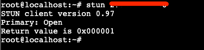

# 概述

本文档介绍如何部署turnserver服务端。

## 安装软件包

> [!IMPORTANT]
> 如果防火墙没有开启并且没有任何限制的话，无需安装`ufw`

```bash
apt update
apt install -y coturn ufw
```

## 配置turnserver

修改配置文件`/etc/turnserver.conf`，这里就直接展示我的配置文件：

```bash
root@localhost:~# grep '^#' -v /etc/turnserver.conf | awk 'NF'
listening-port=3478
listening-ip=0.0.0.0
syslog
stun-only
response-origin-only-with-rfc5780
root@localhost:~# 
```

> [!WARNING]
> 注意下，这里启用stun的话要单机具备两个公网IP，否则可能无法正常工作。

上面这些就是启用的选项，因为只使用`stun`所以启用这些就可以用的。

`listening-port` 监听端口，默认是3478

`listening-ip` 监听地址，默认是0.0.0.0，表示监听所有地址

`syslog` 开启日志功能

`stun-only` 只开启stun功能，不开启turn功能

`response-origin-only-with-rfc5780` 响应来自RFC5780的请求，默认是false，表示响应所有请求

## 启动turnserver

直接启用`coturn`服务，确保服务运行正常

```bash
systemctl restart coturn
# OR
/etc/init.d/coturn restart
```

## 防火墙设置

上面提到的，如果`防火墙没有开启并且没有任何限制`的话，无需进行这一步

顺便说下这里的`3478`端口要和你上面配置文件里面设置的是一样的，开放这个端口。

```bash
ufw allow 3478/tcp
ufw allow 3478/udp
```


## 验证turnserver

验证turnserver是否正常运行，可以使用`stun-client`测试，随便找一台测试机，安装`stun-client`软件，然后运行：

```bash
stun x.x.x.x
```

如果能正常运行，没有提示错误则说明turnserver正常，下面是我的测试结果：



