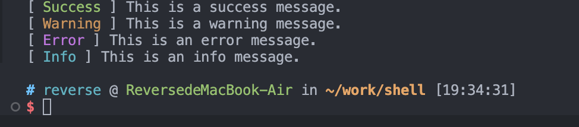

## 介绍

一般我们在使用脚本时经常需要输出一些调试或者流程控制的消息，以便脚本的使用者能够更好地理解脚本的运行情况。

在 Shell 脚本中，我们可以使用 `echo` 命令来输出信息。

```bash
#!/bin/bash

echo "This is a message."
```

但是这样的输出略显单调了，没有任何颜色的加持，找关键数据也不方便，那么我们可以采用以下方式输出带颜色的消息。

```bash
#!/usr/bin/env bash

out_success() {
    echo -e "[ \033[32mSuccess\033[0m ] $1"
}

out_warning() {
    echo -e "[ \033[33mWarning\033[0m ] $1"
}

out_error() {
    echo -e "[ \033[35mError\033[0m ] $1"
}

out_info() {
    echo -e "[ \033[36mInfo\033[0m ] $1"
}


out_success "This is a success message."
out_warning "This is a warning message."
out_error "This is an error message."
out_info "This is an info message."
```

脚本执行结果如下，通过颜色的区分，我们可以很容易地区分不同类型的消息，这样是否看着更显眼了呢。


