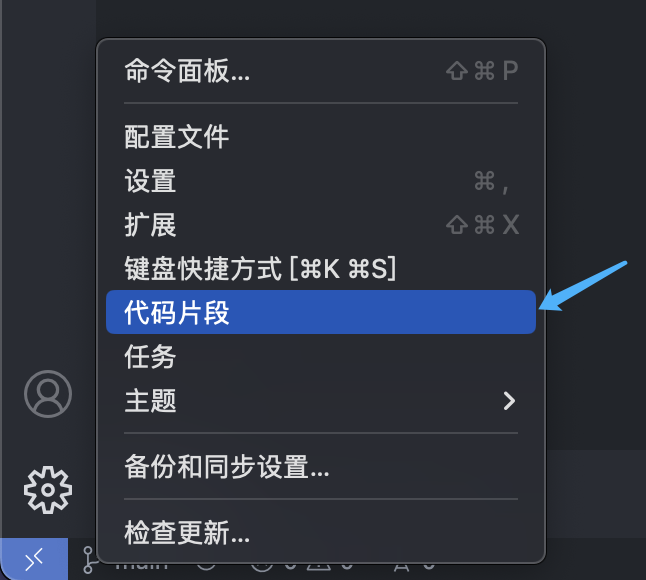

## 操作步骤
1. 打开VsCode。
2. 点击左下角齿轮按钮。
3. 点击弹出窗口中的【代码片段】选项。
4. 输入vue.json，回车。
5. 在打开的json文件中，输入以下内容


   
```json
{
	"My Vue Component": {
		"prefix": "vue3-temp",
		"body": [
			"<template>",
			"  <div>",
			"",
			"  </div>",
			"</template>",
			"",
			"<script setup>",
			"",
			"</script>",
		],
		"description": "New Vue component"
	}
}
```

5. 保存并关闭json文件。
6. 打开一个Vue文件，输入`vue3-temp`则会出现一个Vue组件模板，可以直接使用。
