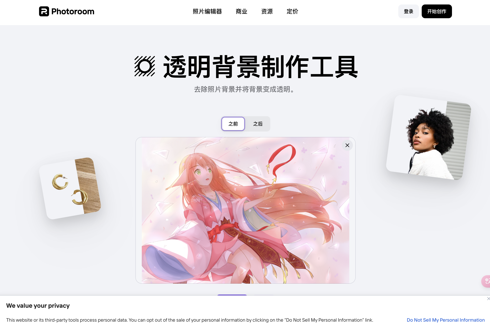
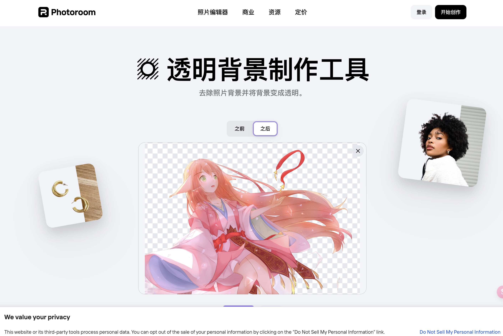

## 介绍

这次介绍一款在线抠图工具，大概的功能就是，能够将你提供的图片背景扣掉，设置为透明的背景，一般可以用来处理头像。

[在线工具地址](https://www.photoroom.com/zh/tools/transparent-background)

## 使用方法

> [!CAUTION]
> 稍微提示一下，这款工具似乎是需要收费的，但是应该是每天有几次免费的机会，所以不用担心。

1. 打开[在线工具地址](https://www.photoroom.com/zh/tools/transparent-background)
2. 上传你想要处理的图片
3. 开始处理，等待几秒钟，即可得到处理后的图片
4. 下载图片，保存到本地

> 处理前

> 处理后

