# 概述

之前一直在用这款密码管理器，不过没有深入研究，只是简单用用。

现在深入研究了一下，发现真不错，虽然没有`1Password`那么强大，但是功能也很全面。

在使用之前，你需要先去下载安装插件，然后注册一个账号，然后登录账号。


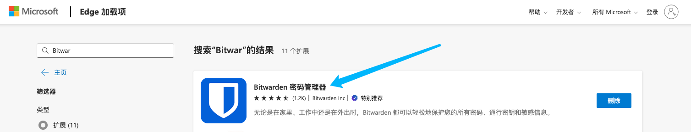

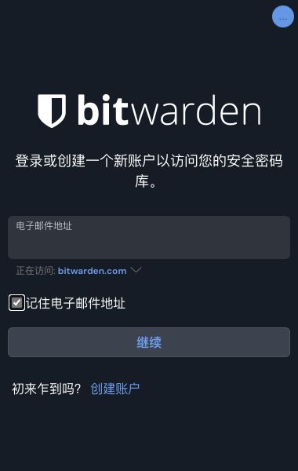


上面登录就不细说了，自行研究即可，下面研究下他的功能。


## 文件夹分类

如果希望密码管理足够规范，就可以创建不同的目录，存放不同用途的密码，比如：

- 工作相关
- 个人相关
- 购物相关
- 其他

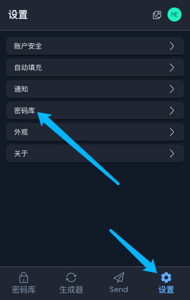

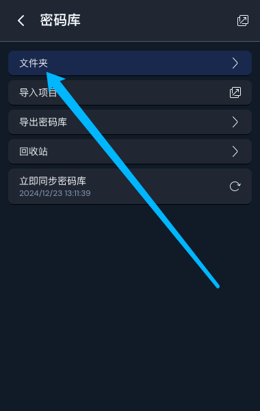

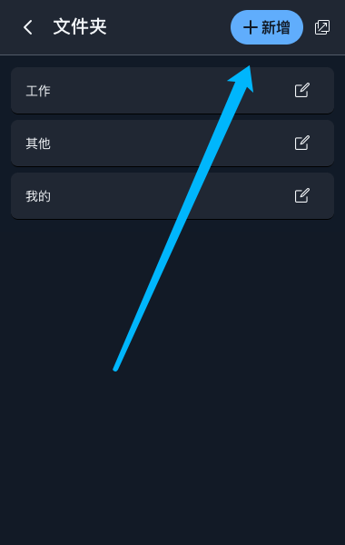

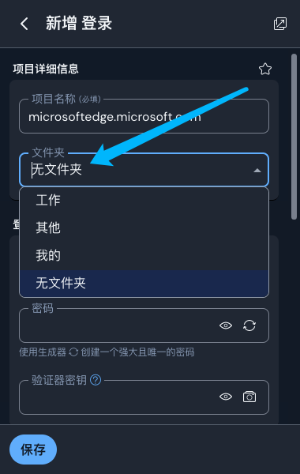

这样的话，创建密码时存放到不同的目录内，可以更好的管理密码。

## 密码生成器

可以生成随机密码，也可以自己设置密码规则，比如：

- 长度
- 包含字符类型
- 密码强度

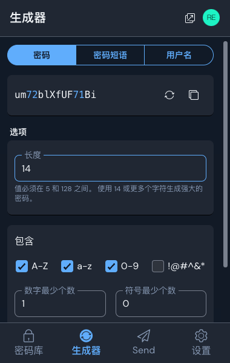


## 密码自动填充

可以在设置中开启自动填充功能，即在网页加载完成时，会自动将密码填写上去，而不需要手动点点点。

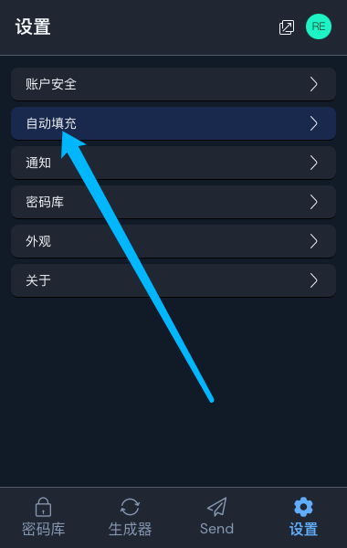

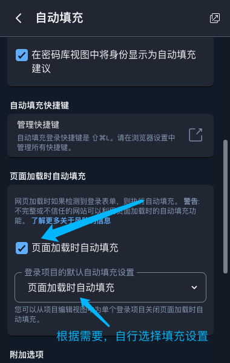


## 正则匹配网址

假设说公司有很多服务器，经常需要连接他们的IPMI，并且IPMI都是有一定规范和格式的。

那你就可以创建一个正则表达式来匹配网址，匹配成功后，自动填充密码，省去了手动输入的麻烦。

假设我有两台服务器，IP地址分别是: `192.168.1.1` 和 `192.168.1.2`，那么我就可以创建一个正则表达式：

```txt
https://192.168.1.[0-9]/login.html
```

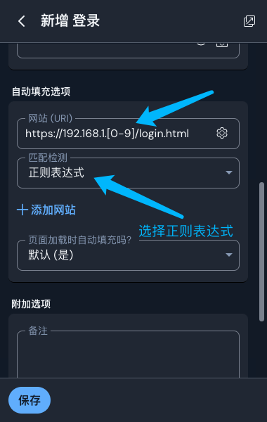

在这个表达式里面，`[0-9]`表示匹配数字从0到9，这样就可以实现匹配`192.168.1.1`和`192.168.1.2`这两个IP地址了。


## Send文本共享

你可以生成任何文本，然后分享给别人，包括密码什么的，生成后Bitwarden会`自动生成一个链接`，别人点击这个链接，可以直接看到你分享的文本。

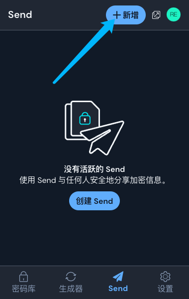

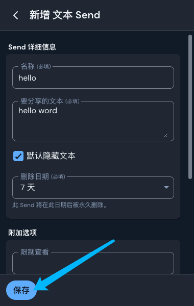

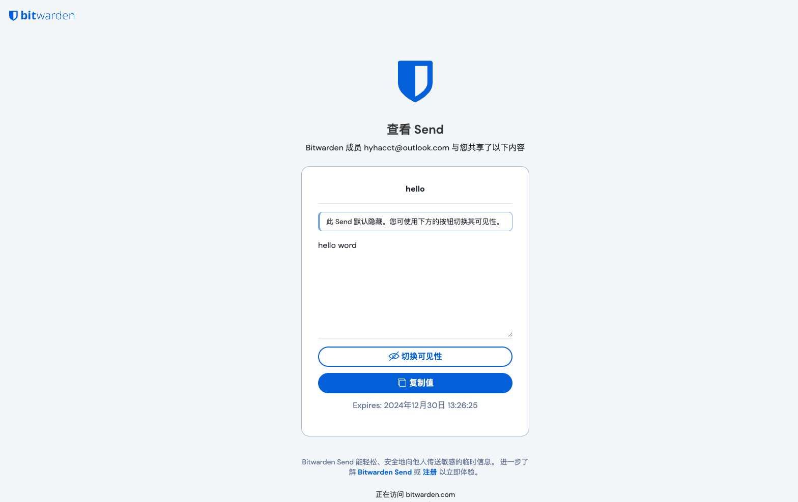


## 总结

事实上，Bitwarden提供了更多的设置和功能，有兴趣可以自行研究探索，毕竟这么一款功能全面并且免费的工具，真的很值得推荐。

以上